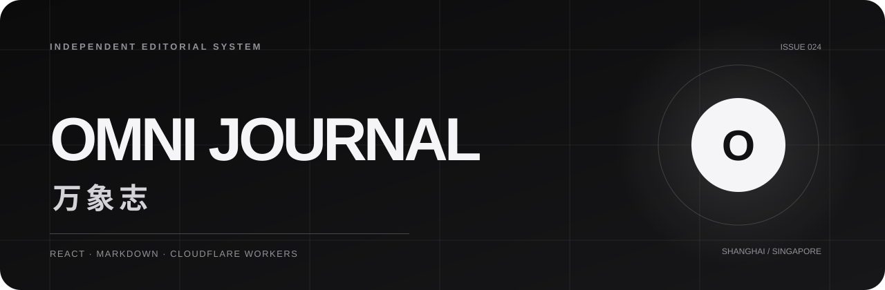
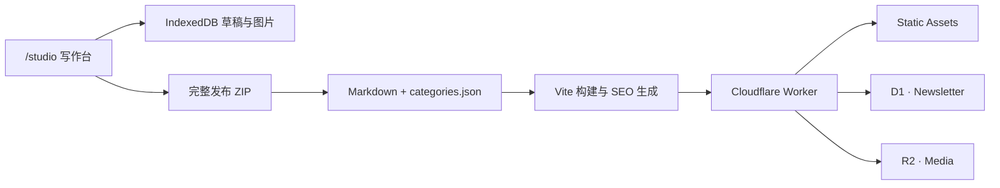

<p align="center">
  
</p>

<h1 align="center">OmniBlog · 万象志</h1>

<p align="center">
  一个安静、克制、适合长期写作的双语个人博客。<br />
  <sub>An editorial publishing system for ideas worth slowing down for.</sub>
</p>

<p align="center">
  
  
  
  
</p>

<p align="center">
  <a href="https://deploy.workers.cloudflare.com/?url=https://github.com/mibgb65-cloud/OmniBlog">
    
  </a>
</p>

<p align="center">
  <a href="#设计与能力">设计与能力</a>&nbsp;&nbsp;·&nbsp;&nbsp;
  <a href="#快速开始">快速开始</a>&nbsp;&nbsp;·&nbsp;&nbsp;
  <a href="#写作与发布">写作与发布</a>&nbsp;&nbsp;·&nbsp;&nbsp;
  <a href="#部署到-cloudflare">Cloudflare 部署</a>
</p>

---

## 项目定位

OmniBlog 不是通用 CMS，而是一套为个人写作者设计的轻量出版系统：文章以 Markdown 长期保存，写作台负责草稿、分类与图片，Cloudflare Workers 负责访问控制、静态资源和数据接口。

界面遵循仓库内的 [Apple Editorial 设计规范](./apple-editorial-blog-design-spec.md)，重点放在排版、留白、阅读节奏和跨页面动效，而不是堆叠组件。

## 设计与能力

| 编辑体验 | 内容系统 | Cloudflare 原生 |
| --- | --- | --- |
| Apple Editorial 视觉语言 | 中英文独立路由与内容回退 | Workers Static Assets |
| 亮暗主题与开屏动画 | Markdown、标签、系列与分类 | D1 Newsletter 订阅 |
| 路由切换与渐进式滚动条 | 全文搜索与相关文章 | R2 文章图片 |
| 响应式阅读布局 | 自动 SEO、RSS 与 Sitemap | Token 保护的写作台 |

写作台支持：

- 中文与英文分别编辑，英文版本可后补
- 粘贴、拖放或选择正文图片，并自动转为 WebP
- 表情插入、Markdown 预览和图片替代文字
- 统一管理草稿与已发布文章，支持搜索、筛选、批量移动和删除本地稿
- 分类与系列集中管理，支持创建、搜索、编辑、占用检查与安全删除
- 新增分类、删除未占用分类，以及分类占用保护
- IndexedDB 自动保存、完整工作区备份与恢复
- 一键导出文章、图片和分类配置组成的发布 ZIP

## 技术架构



## 快速开始

### 普通前端开发

```bash
npm install
npm run dev
```

打开 `http://localhost:5173/zh`。这个模式用于界面和文章开发，不包含 Worker 登录鉴权、D1 与 R2。

### 完整 Cloudflare 本地环境

```powershell
Copy-Item .dev.vars.example .dev.vars
# 将两个示例值替换为不同的随机长密码
npm run cf:dev
```

`.dev.vars` 只保存在本机并已被 Git 忽略。完整环境启动后，通过 `/studio` 登录写作台。

### 构建检查

```bash
npm run check:lines
npm run build
npm run preview
```

仓库内代码文件不得超过 600 个物理行（包含空行）。该检查已接入 `dev`、`test` 与 `build`，超限时会直接失败；依赖、构建产物和锁文件不计入。

## 页面路由

| 路由 | 用途 |
| --- | --- |
| `/zh`、`/en` | 中英文首页 |
| `/zh/stories`、`/en/stories` | 文章索引与全文搜索 |
| `/:locale/stories/category/:categoryId` | 分类文章 |
| `/:locale/stories/:slug` | 文章详情 |
| `/zh/about`、`/en/about` | 关于页面 |
| `/studio` | Token 登录保护的写作台 |

语言位于 URL 中，便于分享、深链接、Canonical 与 `hreflang`。亮暗主题保存在浏览器，并默认跟随系统设置。

## 写作与发布

最短工作流：

1. 在完整本地环境或部署域名打开 `/studio`，使用 `STUDIO_TOKEN` 登录。
2. 编写一种或两种语言，设置分类、标签、系列、封面和正文图片。
3. 下载“完整发布包”，把其中的 `content` 与 `public` 合并到项目根目录。
4. 执行 `npm run build`；检查通过后提交 Git，或运行 `npm run deploy`。

草稿、分类和图片保存在当前浏览器的 IndexedDB 中，不会自动跨设备同步。建议定期在写作台侧栏下载完整备份。

<details>
<summary><strong>查看 Markdown 文章格式</strong></summary>

```md
---
slug: my-story
locale: zh
date: "2026-08-09"
category: design
readMinutes: 6
title: "文章标题"
summary: "文章摘要。"
cover: "/images/articles/my-story/cover.webp"
coverAlt: "准确描述封面内容的替代文字"
tags: ["界面设计", "注意力"]
series: "界面与注意力"
---

文章正文。

## 小标题


```

双语文章使用相同的 `slug`、`date`、`category` 与 `cover`：

```text
content/articles/my-story.zh.md
content/articles/my-story.en.md
```

只有一种语言时，另一语言页面会显示原文提示并设置为 `noindex`；补齐翻译后自动恢复完整双语 SEO。

</details>

### 图片输出

写作台会在浏览器中生成：

| 文件 | 规格 |
| --- | --- |
| `cover.webp` | 1600 × 1000 |
| `thumbnail.webp` | 800 × 500 |
| `og.webp` | 1200 × 630 |
| 正文图片 | 最长边不超过 1600px |

图片可以随发布包进入 `public/images/articles/<slug>/`，也可以使用当前写作台会话直接上传到 R2，并自动把文章路径切换为 `/media/...`。

### 分类管理

在“发布设置 → 管理分类”中添加中英文名称、标识和简介。正在被已发布文章或草稿使用的分类会锁定删除，避免导出后产生失效文章。

完整发布包会包含最新的 `content/categories.json`；仅下载单个 Markdown 不会更新分类配置。

### 下线已发布文章

文章管理支持批量删除已发布文章。写作台会请求受登录会话保护的 Worker API，由 Worker 在 GitHub 创建一个原子提交，同时删除该 slug 的中英文 Markdown、`public/images/articles/<slug>/` 图片和 R2 图片。浏览器只发送 slug，不会接触 GitHub token。

在 GitHub 创建仅限当前仓库、仅有 **Contents: Read and write** 权限的 fine-grained token，然后保存为 Cloudflare Secret：

```bash
npx wrangler secret put GITHUB_CONTENT_TOKEN
```

仓库和分支由 `wrangler.jsonc` 中公开的 `GITHUB_REPOSITORY`、`GITHUB_BRANCH` 指定。若希望删除提交后自动上线，请先把 Worker 连接到 GitHub 仓库，再在 Cloudflare **Settings → Builds → Deploy Hooks** 创建 `main` 分支 Hook，并保存为 Secret：

```bash
npx wrangler secret put CLOUDFLARE_DEPLOY_HOOK
```

未配置 Deploy Hook 时，仓库删除仍会完成，但写作台会明确提示需要手动执行 `npm run deploy`。删除提交可以通过 Git 历史恢复。

## SEO 与站点配置

在 [`content/site.json`](./content/site.json) 中设置正式域名、作者、邮箱与 Cloudflare Web Analytics token。构建会生成：

- 每个中英文页面的独立元数据
- Canonical、`hreflang` 与 Open Graph
- Twitter Card 与 `BlogPosting` 结构化数据
- `sitemap.xml`、`rss.xml` 和 `robots.txt`

生成文件不需要手动维护。

## 部署到 Cloudflare

### 一键部署

<a href="https://deploy.workers.cloudflare.com/?url=https://github.com/mibgb65-cloud/OmniBlog">
  
</a>

Cloudflare 会读取 [`wrangler.jsonc`](./wrangler.jsonc) 与项目绑定声明，并在部署流程中引导配置 Worker、D1 和 R2。Secret 只在 Cloudflare 界面填写，不会写回公开仓库。

部署时需要准备：

| 配置 | 是否必需 | 用途 |
| --- | --- | --- |
| `STUDIO_TOKEN` | 是 | 写作台登录并签发 12 小时 HttpOnly 会话 |
| `ADMIN_TOKEN` | 可选 | 命令行或外部工具通过 Bearer Token 上传图片 |
| `GITHUB_CONTENT_TOKEN` | 删除线上文章时必需 | 仅授予当前仓库 Contents 写权限 |
| `CLOUDFLARE_DEPLOY_HOOK` | 可选 | 删除提交后触发生产分支构建 |
| `DB` | 是 | Newsletter 订阅数据 |
| `MEDIA` | 是 | 封面与正文图片 |

`STUDIO_TOKEN` 与 `ADMIN_TOKEN` 必须使用不同的高强度随机值。

### Wrangler 命令行

```bash
npx wrangler login
npx wrangler secret put STUDIO_TOKEN
npx wrangler secret put ADMIN_TOKEN
npx wrangler secret put GITHUB_CONTENT_TOKEN
npx wrangler secret put CLOUDFLARE_DEPLOY_HOOK
npm run deploy
```

部署前确认 `content/site.json` 的 `siteUrl` 是正式公开域名；构建会用它生成 Canonical、RSS 和 Sitemap。域名不是密钥，可以安全保存在公开仓库。

`npm run deploy` 会先执行 D1 migrations，再部署 Worker。需要单独迁移数据库时可运行：

```bash
npm run db:migrate
```

静态页面的安全响应头和哈希资源长缓存由 `public/_headers` 管理。

## 目录结构

```text
OmniBlog/
├─ content/
│  ├─ articles/          # Markdown 文章
│  ├─ categories.json    # 双语分类
│  └─ site.json          # 站点与 SEO 配置
├─ public/
│  └─ images/articles/   # 本地文章图片
├─ src/                  # React 界面、路由与写作台
├─ worker/               # 登录、D1 与 R2 接口
├─ scripts/              # 静态页面、RSS 与 Sitemap 生成
└─ wrangler.jsonc        # Cloudflare Workers 配置
```

## 公开仓库安全

- 不要提交 `.dev.vars`、`.env`、API Token、私钥或 `.wrangler` 本地状态。
- 仓库只保留 `.dev.vars.example` 占位符；真实值使用 Cloudflare Secrets。
- 推送前运行 `git status`，确认 `dist`、本地备份和敏感配置没有进入暂存区。
- 如果 Token 曾出现在 Git 历史中，应立即撤销并重新生成；删除文件不能让旧 Token 失效。

查看远端订阅者：

```bash
npx wrangler d1 execute DB --remote --command "SELECT email, locale, created_at FROM subscribers WHERE status = 'active' ORDER BY created_at DESC"
```

## Credits

- UI 依据项目内 [Apple Editorial Blog Design Specification](./apple-editorial-blog-design-spec.md) 实现。
- 品牌标题使用 Noto Serif SC 精简字体子集，遵循 [SIL Open Font License 1.1](./public/fonts/OFL-NotoSerifSC.txt)。

<p align="center"><sub>Independent writing. Quietly published.</sub></p>
